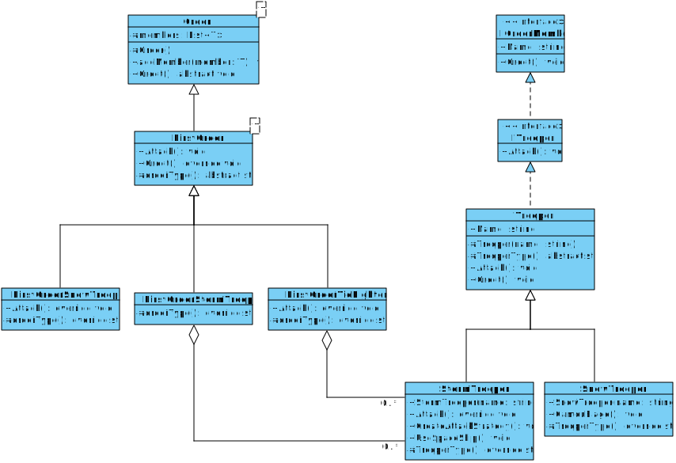
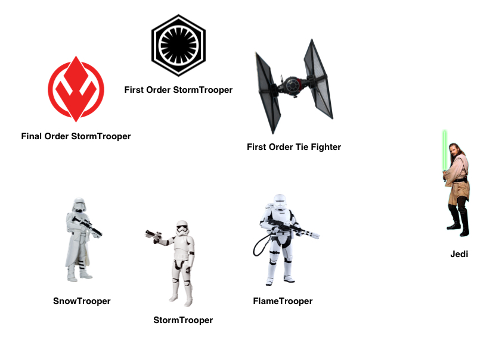

# StarWars Episodio UCU
### FIT - Universidad Católica del Uruguay

En este rama se puede ver un ejemplo de aplicación de [Herencia, Agregación](https://github.com/ucudal/PII_Conceptos_De_POO/tree/master/Capitulos/5_Herencia_Agregacion) y [Tipos Genéricos](https://github.com/ucudal/PII_Conceptos_De_POO/tree/master/Capitulos/3_Tipos_Genericos).

## Diagrama de clases

****

Para quienes no están familiarizados con el universo de StarWars, dejamos aquí una imágen con algunos de los conceptos.

