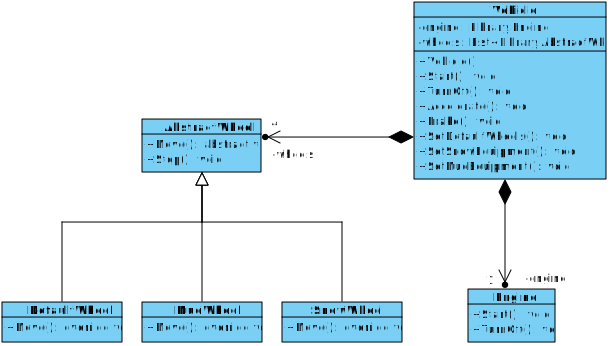

# ATV1 UCU
### FIT - Universidad Católica del Uruguay

En este rama se puede ver un ejemplo de aplicación de [Composicion y Delegación](https://github.com/ucudal/PII_Conceptos_De_POO/tree/master/Capitulos/6_Composicion_Delegacion)

## Diagrama de clases

****

_1 All Terrain Vehicle ver https://es.wikipedia.org/wiki/Cuatrimoto._
